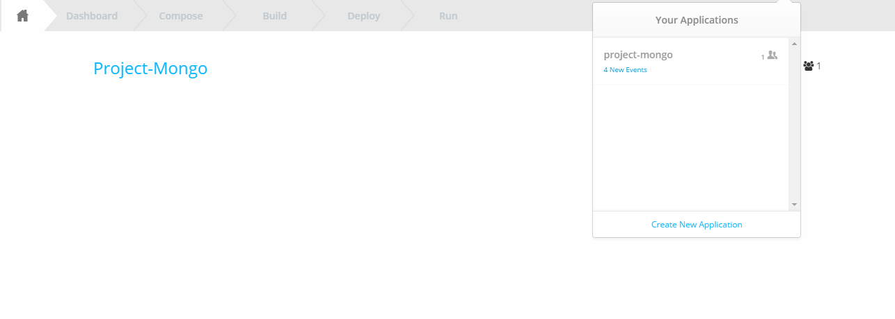
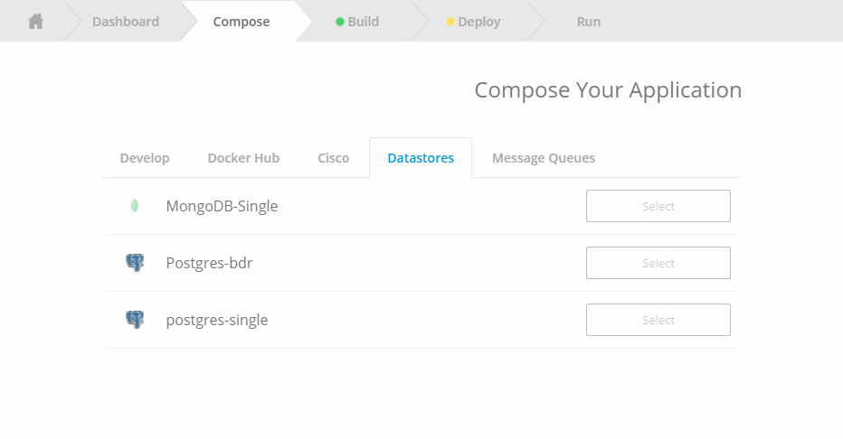
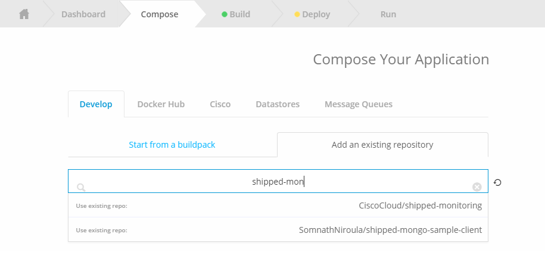
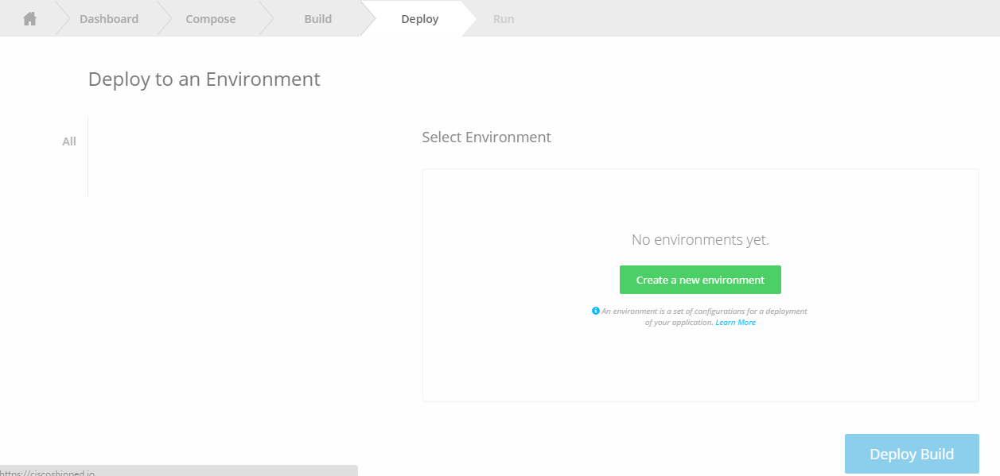
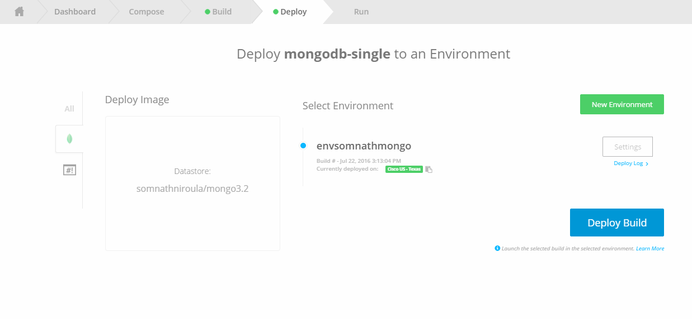
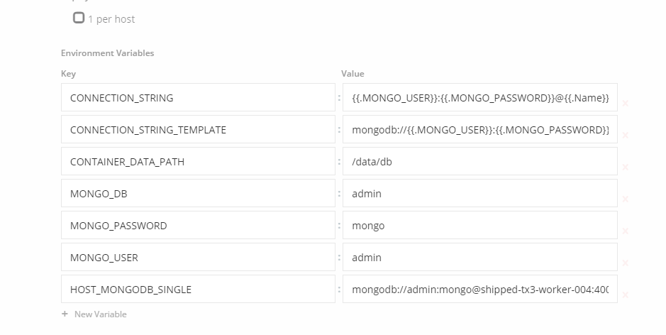
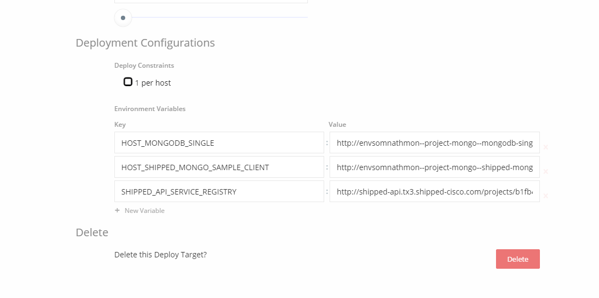
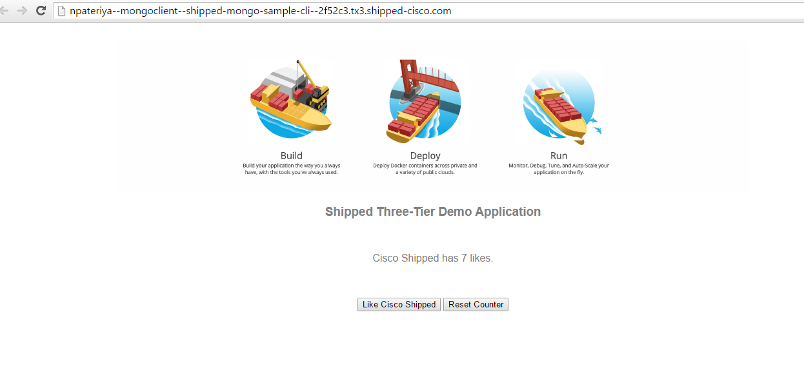

Shipped-Multi-tier Demo Application Shipped Mongo DB client APP
===================================
Shipped enables you to build a multi-tier application to allow any application developed and distributed among more than one tier. The multi-tier app logically separates the different application-specific tier. This division allows each tier to be separately developed, tested, executed, and reused.

Shipped provides a sample multi-tier app containing the service shipped-mongo-sample-client.

Service Name    Technology    Details          
mongo-client    python        $host_api_url/     GET    
                              $host_api_url/like  POST     
mongo-db        mongo         Creating DB from datastore in shipped.

Prerequisite:
=============
Fork shipped-mongo-sample-client from CiscoCloud. When done, contents are copied from Cisco Cloud to your public repo.

Create a Project and Add Services :
===================================
1> Log in to Shipped UI.    
2> Click Create New Application.   
     
3> Enter a new project name, for example, mongoapp, click Start Composing.    
4> Click Add an existing repository, and search for shipped-mongo-sample-client.      
5> Click Datastores and select MongoDB-Single.       
        
6> Click Add Service. abd serach for shipped-mongo-sample-client that was forked.      
     
Click Save Project to trigger a build for all the services added.         

Create an Environment for Deployment :
======================================
Environments are virtual places to deploy your project.       

1> Click New Environment.      
       
2> Enter the name for the environment, Test for example.       
3> Click Save.       

You are now ready to deploy Mongo and shipped-mongo-sample-client services. The order of service deployment is important. Because Mongo has a set of default environment variables that other services depend on, therefore it is the first to be deployed. After Mongo is deployed, you can copy those variables and apply them to shipped-mongo-sample-client.        

Deploy Mongo :
==============
1> Click the Deployment tab.      
2> Select Mongo and the environment (Test), click Deploy Build.      
      
As we need connection string to connect our API to Mongo DB, So we need to copy the environment variable name "HOST_MONGODB_SINGLE" (naming convention "HOST"$servicename) of Mongo, which you need to set for shipped-mongo-sample-client.       
3> Click Settings.      
4> Scroll down to the Deployment Configurations section.     
      
5> Copy the environment variables.       

Deploy shipped-mongo-sample-client:
===================================
1> Click Back to Environments.       
2> Click the shipped-mongo-sample-client icon, then Settings.      
3> Scroll down to the Deployment Configurations section.       
4> Enter HOST_MONGODB_SINGLE environment variable name and its value.       
  
 
This page will open up after deployment :       
  

